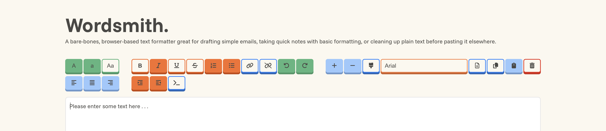

# Wordsmith: Your Quick & Simple Text Formatting Sidekick 🪄
This is a Lexical.js-powered rich text editor that lets users focus on writing content ✍️ while providing easy-to-access tools for quick and speedy formatting. ✨ Wordsmith is great for drafting simple emails, taking a quick note, or tidying up plain text before pasting it elsewhere.

### What's in the Toolbox?
Below is a growing list of formatting options as of version `1.0`.
- Capitalize
- Uppercase, Lowercase
- Bold
- Italicize
- Underline
- Strikethrough
- Ordered Lists, Unordered Lists
- Hyperlink
- Undo, Redo
- Increase Font, Decrease Font
- Change Font Color
- Copy Selection, Copy All, Paste from Clipboard
- Clear Editor
- Left Align, Center Align, Right Align
- Indent, Outdent
- Print Selection to Javascript Console
- Dark and Light Mode (System-Preference Dependent)

### What's Cooking? 🍳 (Coming Up Next)
Wordsmith is still under development so I'll constantly be adding new features. Coming up next includes support for:
* More Font Options
* Copy/Paste Images and Embed Links
* Tables and Table Formatting
* Reset Formatting on Text Selection
* Dark and Light Mode UI Toggler
* Developer Debug Mode
* Save and Restore Notes
* Live Link to Note
* Save Frequent Email Signature(s) 

### Unsupported Features
I currently have no intention to add the below features to the text editor but that could change at any time:
- Nested Lists
- Nested Tables
- Email Directly from Editor

### Feedback is Welcome 👍👎
Create an issue or reach out to me personally :)

### **Happy Wordsmithing ✏️**